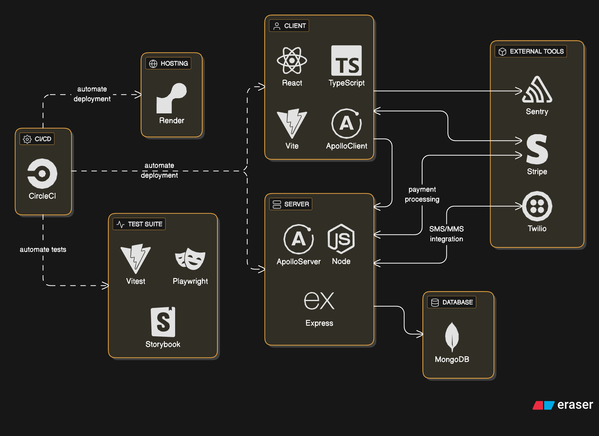

# Scavenger Hunt [](https://dl.circleci.com/status-badge/redirect/circleci/KaPY5DRacCDokmFK4eGLRe/TaQGeiEsqhUYuNcoDGRjDZ/tree/master)

This repo will eventually hold a scavenger hunt app that will utilize the Twilio texting service.

### Production Links

Application: https://digital-scavenger-ui.onrender.com/

Storybook: https://digital-scavenger-storybook.onrender.com/

### System Overview


_\*Created via [eraser.io](https://www.eraser.io/)._

### Local Development - Getting Started

- Install root dependencies

      yarn install

- Configure pre-commit checks

  _\*This only has to be run once after cloning the repo._

      yarn prepare

### Local Development - `/client`

- Install client dependencies

      yarn install

- To start the storybook server locally:

      yarn storybook

- To run the app in the development mode:<br />

      yarn start

  _Open [http://localhost:3000](http://localhost:3000) to view it in the browser.
  The page will reload with edits. You will also see any lint errors in the console._

- To start the test suite:

      yarn test

### Local Development - `/server`

From the terminal in your local project:

1.  Make sure the `MONGO_URI` value in your .env file is accurate, then install dependencies

         yarn install

2.  Go to the `/server/` dir, run this command:

         yarn dev

After the server is running, do the following from inside Postman:

1. Create a collection. This will allow you to store and use collection variables
2. make sure the below variables are set:

   - `baseURL` -- I have 2 of these I toggle between. One for `localhost` and one for my deployed server in prod
   - `authToken` -- This will start out as empty

3. Create a new query in the collection
4. In the query input field, simply put `{{baseURL}}`
5. On the "Authorization" tab for that query, make the below selections:

   - Type: `Bearer Token`
   - Token: `{{authToken}}`

6. You must run the `login` mutation first. Copy the token value from the response object.
7. Go back to your collection's variables. Paste the copied token value into the field for the `authToken` variable.
8. Run any query or mutation as you please!!!

### Example `.env` content

```txt
TWILIO_ACCT_SID=< provided by Twilio >
TWILIO_AUTH_TOKEN=< provided by Twilio >
TWILIO_NUMBER=< provided by Twilio >

# FOR LOCAL DEV ONLY - PROD VALUES SET VIA CI PIPELINE
CLIENT_URL=http://localhost:< port >
SERVER_URL_GQL=http://localhost:< port >/graphql
MONGO_URI=< constructed with MongoDB details >

SESSION_SECRET=< randomly button smash a long value >
PORT=< 5 digit number >

JWT_SECRET=< randomly button smash a long value >
ACCESS_TOKEN_SECRET=< randomly button smash a long value >
ACCESS_TOKEN_DURATION=1d
REFRESH_TOKEN_SECRET=< randomly button smash a long value >
REFRESH_TOKEN_DURATION=14d
```
